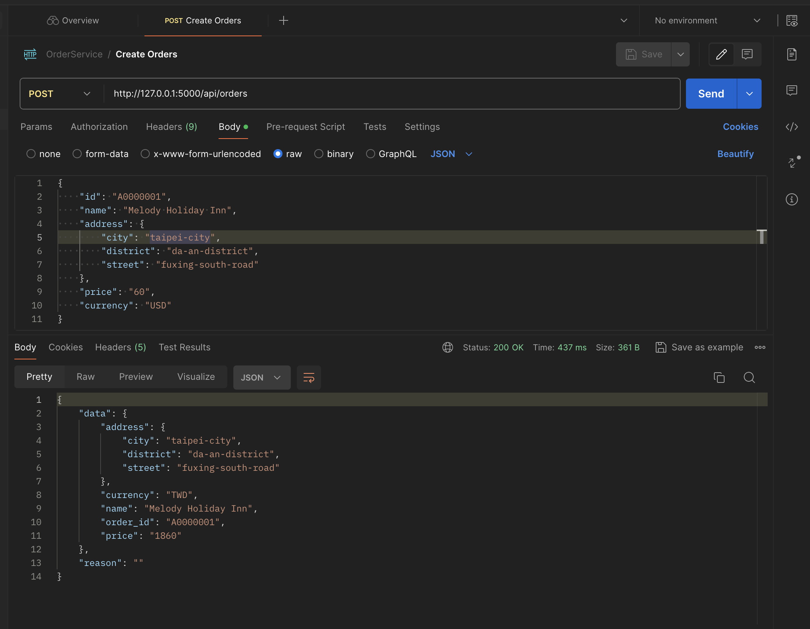
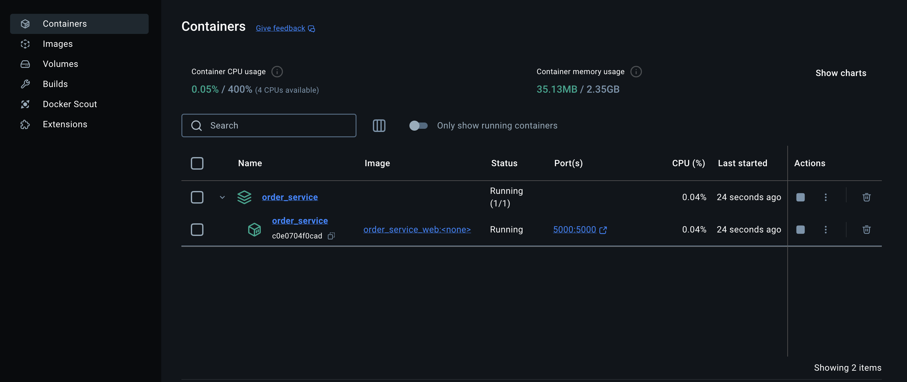

# Order API

## SOLID Principles

1. **單一職責原則 (Single Responsibility Principle, SRP)**:
   - `CreateOrderValidator` 類別負責驗證訂單數據。
   - `create_order_impl` 函數負責創建訂單的具體實現。
   - `app.py` 中的 `create_order` 路由處理 HTTP 請求並調用相應的業務邏輯。
   - `Address` 類別負責處理地址相關的數據和邏輯。
   - `Order` 類別負責處理訂單相關的數據和邏輯。

2. **開放封閉原則 (Open/Closed Principle, OCP)**:
   - `Validator` 抽象類別允許擴展新的驗證器，而不需要修改現有的代碼。
   - `CreateOrderValidator` 繼承自 `Validator`，實現了具體的驗證邏輯。
   - `Address` 和 `Order` 類別可以通過繼承和擴展來添加新功能，而不需要修改現有的代碼。

3. **里氏替換原則 (Liskov Substitution Principle, LSP)**:
   - `CreateOrderValidator` 可以替換 `Validator`，並且不會改變程序的正確性。
   - 如果有子類繼承 `Address` 或 `Order`，它們應該能夠替換基類而不改變程序的正確性。

4. **介面隔離原則 (Interface Segregation Principle, ISP)**:
   - `Validator` 抽象類別只定義了 `validate` 方法，確保子類只需實現這個方法。
   - 如果 `Address` 和 `Order` 實現了某些接口，這些接口應該是專門的，確保子類只需實現它們需要的方法。

5. **依賴反轉原則 (Dependency Inversion Principle, DIP)**:
   - `app.py` 中的 `create_order` 函數依賴於抽象的 `Validator` 類別，而不是具體的實現。

## Design Patterns

1. **策略模式 (Strategy Pattern)**:
   - `Validator` 抽象類別和 `CreateOrderValidator` 具體實現類別的結構符合策略模式的定義。可以根據需要替換不同的驗證策略。

2. **模板方法模式 (Template Method Pattern)**:
   - `Validator` 抽象類別中的 `validate` 方法定義了驗證的模板，具體的驗證邏輯由子類 `CreateOrderValidator` 實現。

3. **值對象模式 (Value Object Pattern)**:
   - `Address` 類別可以作為值對象，因為它通常是不可變的並且只包含數據。

4. **聚合根模式 (Aggregate Root Pattern)**:
   - `Order` 類別可以作為聚合根，因為它通常包含其他實體（如 `OrderItem`）並且負責訂單的整體一致性。

## Running the Application

# 建置 Docker 映像檔
   ```sh
    docker build -t orderServiceImage .
   ```

# 啟動 Docker Compose 服務
   ```sh
    docker-compose up
   ```

# 停止 Docker Compose 服務
   ```sh
    docker-compose down
   ```

# API
- The API will be available at http://localhost:5000/api/orders.

# Testing
- Run the following command to execute the unit tests:
   ```sh
    python -m unittest discover test
   ```

# Testing Example (Postman)
- Use Postman and import OrderAPI.postman_collection.json to view the API documentation.

# Postman Image


# Docker Image
